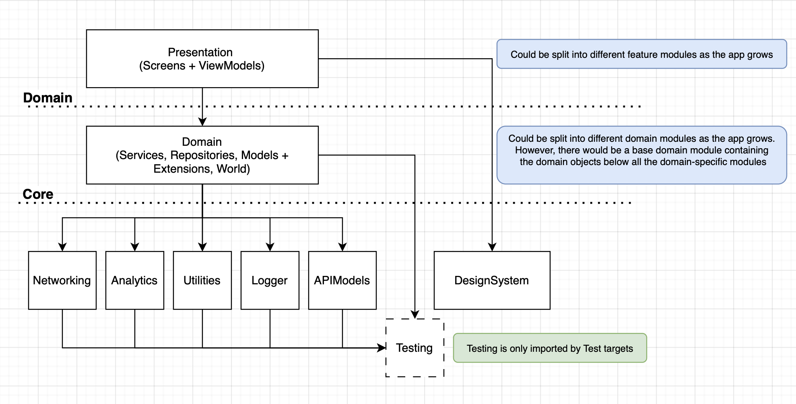

# Modular Example

A modular iOS app starting point.



A deeper explanation can be found in the [blog post](https://manu.show/2025-02-27-simple-modularization-setup/).

## How to start using this?

As packages are really easy to move around, importing this structure into your app is as easy as:

1. Clone the repository
2. Copy the Pakcages folder into your project
3. Add the `Presentation` local dependency in your Xcode Project or SPM Package.

In your repository, you could also add [Contributing Guidelines](/2023-01-02-new-app-contributing-guidelines/) and [The Definition of Done](/2023-05-13-the-definition-of-done/).

There is also a [contributing guidelines](.github/CONTRIBUTING.md) document in this repository that can be used as a starting point.

## Testing

This project uses Fastlane to automate testing across all packages. To run tests for all packages on iOS simulators:

```bash
fastlane test_all_packages
```

To run tests for a specific package:

```bash
fastlane test_scheme scheme:PackageName
```

For example, to test the Logger package:

```bash
fastlane test_scheme scheme:Logger
```

Test results are stored in the `test_output` directory at the project root level.

See the [Fastlane README](fastlane/README.md) for more details.
